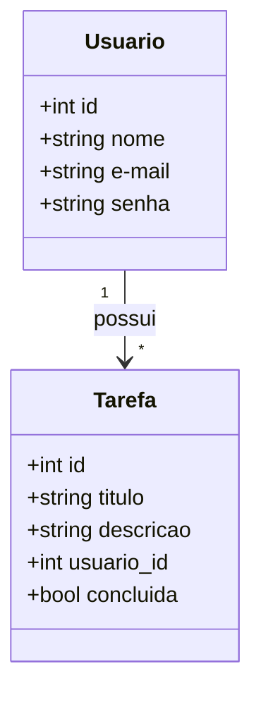
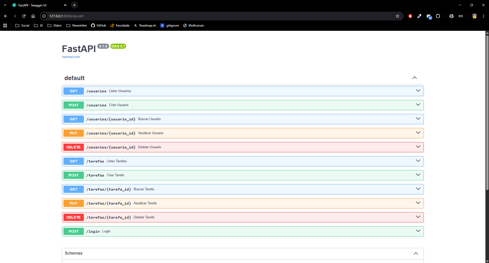

# API To Do List


## Escopo da solução:

Desenvolvimento de API para sistema de ToDoList, com usuários e tarefas.

## Tecnologias Utilizadas

- FastAPI 0.128.0
- Uvicorn 0.40.0
- SQLAlchemy 2.0.46
- Passlib 1.7.4
- Bcrypt 4.0.1

## Como executar

### 1. Clone o repositório:

```bash
git clone https://github.com/igorpaula7/api-to-do-list.git
cd api-to-do-list
```

### 2. Crie o ambiente virtual e instale as dependências:

```bash
python -m venv venv

# Linux / Mac:
source venv/bin/activate

# Windows:
venv\Scripts\ activate
```

```bash
pip install -r requirements.txt
```

### 3. Execute a aplicação:

```bash
uvicorn main:app --reload
```

### 4. Acesse a documentação interativa:

```bash
http://127.0.0.1:8000/docs
```

## Modelagem de dados



## Endpoints:

### Usuários:

`GET /usuarios` - Lista todos os usuários;  
`GET /usuarios/{id}` - Busca usuário por ID;  
`POST /usuarios` - Cria novo usuário;  
`PUT /usuarios/{id}` - Altera um usuário existente;  
`DELETE /usuarios/{id}` - Deleta um usuário.  
`POST /login` - Efetua o login na aplicação.

### Tarefas:

`GET /tarefas` - Lista todas as tarefas;  
`GET /tarefas/{id}` - Busca uma tarefa específica;  
`POST /tarefas` - Adiciona uma tarefa;  
`PUT /tarefas/{id}` - Altera uma tarefa;  
`DELETE /tarefas/{id}` - Deleta uma tarefa.

### Preview:


