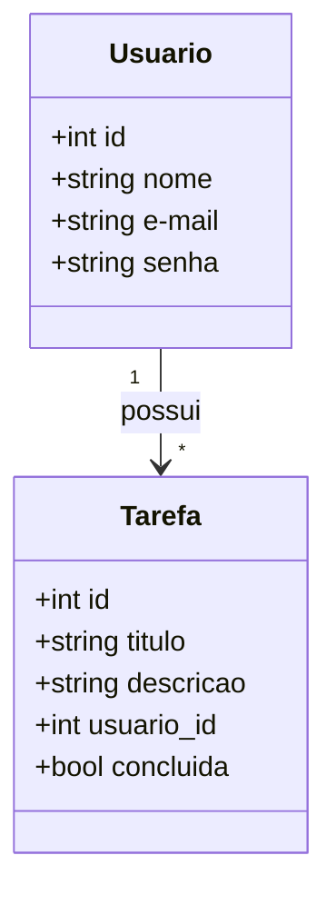

# API To Do List

## Escopo da solução:

Desenvolvimento de API para sistema de ToDoList, com usuários e tarefas.

## Tecnologias Utilizadas

- FastAPI
- Uvicorn
- SQLAlchemy

## Modelagem de dados

## Endpoints:

### Usuários:

`GET /usuarios` - Lista todos os usuários;  
`GET /usuarios{id}` - Busca usuário por ID;  
`POST /usuarios` - Cria novo usuário;  
`PUT /usuarios/{id}` - Altera um usuário existente;  
`DELETE /usuarios/{id}` - Deleta um usuário.  
`POST /login` - Efetua o login na aplicação.

### Tarefas:

`GET /tarefas` - Lista todas as tarefas;  
`GET /tarefas/{id}` - Busca uma tarefa específica;  
`POST /tarefas` - Adiciona uma tarefa;  
`PUT /tarefas/{id}` - Altera uma tarefa;  
`DELETE /tarefas/{id}` - Deleta uma tarefa.
